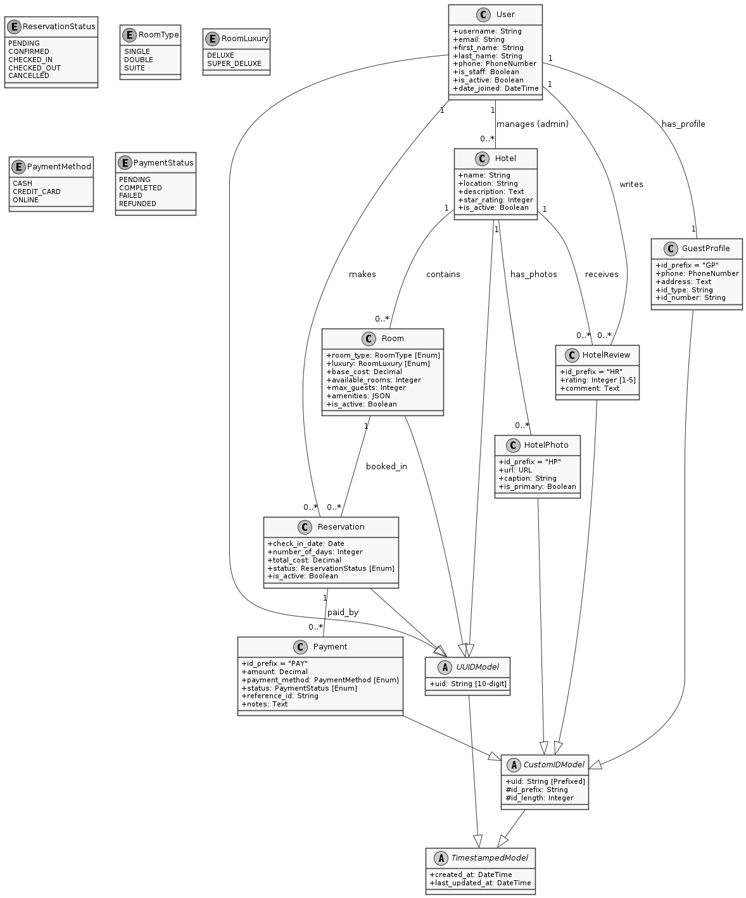

# Hotel Reservation System

This document provides technical details for a hotel reservation system built with Django 5.0.7 and Django REST Framework. The system offers a RESTful API for managing hotels, rooms, and reservations, incorporating JWT authentication, Redis caching, and Celery for background task processing.

## Architecture Diagram

## Architecture Overview

The system is designed as a monolithic application with a clear separation of concerns, organized into the following core components:

### Core Entities

*   **User**: The central identity entity, managing authentication and administrative privileges. Inherits from `UUIDModel` for a 10-digit numeric ID.
*   **Hotel**: Managed by an Admin User, containing metadata such as location, description, and star ratings.
*   **Room**: Associated with a Hotel, defining availability, luxury levels (Deluxe, Super Deluxe), and base costs.
*   **Reservation**: Links a User to a specific Room for a defined duration, automatically calculating total costs and managing lifecycle states.
*   **GuestProfile**: Extended metadata for Users (e.g., address, phone, ID verification), using the `GP-` prefix.
*   **Payment**: Records financial transactions linked to Reservations, tracking status and payment methods with the `PAY-` prefix.
*   **HotelReview**: User-submitted ratings and comments for Hotels, ensuring one review per user/hotel.
*   **HotelPhoto**: Manages hotel imagery with support for primary photo selection and S3 URLs.

### Data Integrity Patterns

*   **Auditability**: All primary entities inherit from `TimestampedModel` for automated `created_at` and `last_updated_at` tracking.
*   **Identity**: Entities utilize `UIDModel` for consistent, business-safe unique identifiers across the system.
*   **Normalization**: Room types and luxury levels are managed via structured Enums to ensure data consistency.

## Detailed Architecture

### 1. Identity & Domain Modeling
The system utilizes a custom identity strategy to ensure global uniqueness and business-readable identifiers without leaking internal primary keys.

*   **UUIDModel**: Generates 10-digit unique numeric identifiers using high-entropy entropy sources with a collision-retry mechanism.
*   **CustomIDModel**: Supports domain-specific prefixed identifiers (e.g., GP- for Guest Profiles) to provide meaningful IDs for external interfaces.
*   **Transactional ID Generation**: All unique identifiers are generated within a retry loop that handles database IntegrityError at the application layer, ensuring 100% uniqueness even under high concurrency.

### 2. Write Layer: Command Orchestration
Business logic is strictly decoupled from the API layer and encapsulated within Service Modules.

*   **Atomic Transactions**: Every state-changing operation (e.g., create_reservation, check_out) is wrapped in a database transaction to ensure atomicity.
*   **Concurrency Control**: Critical resources (like room availability) are managed using row-level locking (select_for_update) to prevent overbooking in race conditions.
*   **State Machine**: Reservation transitions (Pending -> Confirmed -> Checked In) are enforced through service-level logic, preventing invalid state transitions.

### 3. Read Layer: Performance Optimization
Read operations are optimized for speed and reduced load on the primary writer node.

*   **Replica Routing**: Querysets are explicitly routed to read-only replicas using .using("replica").
*   **Projections & Eager Loading**: To minimize memory overhead and "N+1" query issues, the system uses targeted projections (.only(), .values()) and optimized joins (.select_related(), .prefetch_related()).
*   **View-Model Separation**: Read models are projected directly from the ORM into specific response schemas, ensuring that internal database structures are never directly exposed.

### 4. I/O Validation & Security
The system implements a "Whitelist by Default" strategy for all incoming data.

*   **Character Whitelisting**: A custom CharacterPatternValidator enforces strict character sets (e.g., ALPHANUMERIC, SAFE_TEXT) to mitigate XSS and Injection vectors before data reaches the persistence layer.
*   **Sanitization at the Edge**: Input strings are HTML-unescaped before validation to ensure that encoded malicious payloads are detected.
*   **Strict Serializers**: Data transfer objects (DTOs) handle schema enforcement, type coercion, and business rule validation.

### 5. Infrastructure & Scalability
The platform is designed to be stateless and horizontally scalable.

*   **Persistence**: PostgreSQL with a primary-replica configuration.
*   **Asynchronous Processing**: Celery handles background tasks such as expiring stale reservations and releasing locked inventory.
*   **Distributed Caching**: Redis serves as both the message broker for Celery and the primary cache for high-frequency lookups.
*   **Object Storage**: AWS S3 is used for durable, stateless storage of hotel media assets.

### 6. Observability
*   **Distributed Tracing**: Every request is assigned a unique RequestID via middleware, which is propagated through logs and headers.
*   **Structured Logging**: Logs are formatted for ingestion by modern observability stacks (e.g., ELK, Grafana Loki), including request context and correlation IDs.

---

## Tech Stack (Technical Perspective)

*   **Core Logic**: Python 3.10+
*   **Application Framework**: Django (utilized primarily as an ORM and Routing engine)
*   **API Layer**: Django Rest Framework (DRF)
*   **Persistence**: PostgreSQL
*   **Cache/Broker**: Redis
*   **Task Queue**: Celery
*   **Auth**: JWT (Stateless)
*   **Infrastructure**: Docker, AWS S3
