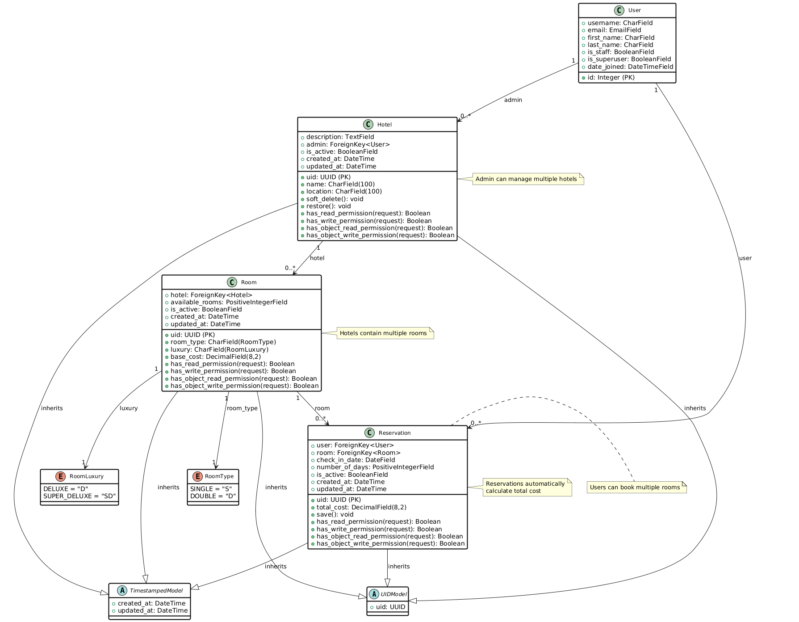

# Hotel Reservation System

This document provides technical details for a hotel reservation system built with Django 5.0.7 and Django REST Framework. The system offers a RESTful API for managing hotels, rooms, and reservations, incorporating JWT authentication, Redis caching, and Celery for background task processing.

## Architecture Overview

The system is designed as a monolithic application with a clear separation of concerns, organized into the following core components:


### Core Components

- **Hotel Management**: Supports CRUD operations for hotels, restricted to admin users.
- **Room Management**: Manages room inventory with real-time availability tracking.
- **Reservation System**: Facilitates user bookings with automatic availability updates.
- **Authentication & Authorization**: Implements JWT-based authentication with role-based permissions.
- **Background Processing**: Utilizes Celery for asynchronous task execution.
- **Caching**: Employs Redis to enhance performance through caching.

## Database Schema

The system uses a relational database with the following entity relationships:



### Entity Relationships

- **User** can manage multiple **Hotels** (as admin)
- **Hotel** contains multiple **Rooms**
- **User** can create multiple **Reservations**
- **Room** can have multiple **Reservations**
- **Reservation** automatically calculates total cost from room price and number of days

### Model Structure

- All models inherit from base classes providing UUID primary keys and timestamps
- Soft delete functionality implemented via `is_active` flags
- Comprehensive permission system with role-based access control
- Automatic cost calculation in reservation model

## Technology Stack

### Backend Framework
- Django 5.0.7: A high-level Python web framework.
- Django REST Framework: A toolkit for building Web APIs.
- Django Simple JWT: Provides JWT-based authentication.
- Dry REST Permissions: Enhances API permission management.

### Database & Caching
- SQLite: Default database (planned migration to PostgreSQL).
- Redis: Used for caching and as a Celery message broker.
- Django Redis: Integrates Redis as a cache backend.

### Background Processing
- Celery: Distributed task queue for asynchronous operations.
- Celery Beat: Scheduler for periodic tasks.

### Development Tools
- Poetry: Manages dependencies and packaging.
- pytest: Framework for writing and running tests.
- pytest-django: Django-specific testing utilities.
- model-bakery: Generates test data automatically.
- pre-commit: Enforces code quality through Git hooks.

## Authentication & Authorization

### JWT Token Management
- **Access Token**: Valid for 15 minutes for secure API access.
- **Refresh Token**: Valid for 24 hours for token renewal.
- **Token Blacklisting**: Automatically blacklists tokens after rotation.

### Permission System
- **Public Access**: Unauthenticated users can register and log in.
- **User Permissions**: Authenticated users can view hotels/rooms and create bookings.
- **Admin Permissions**: Staff users can manage hotels and rooms.
- **Rate Limiting**: Limits requests to 5 per minute for both authenticated and anonymous users.

## Configuration

### Environment Variables
```bash
REDIS_URL=redis://localhost:55000   
SECRET_KEY=your-secret-key         
DEBUG=True                          
```

### JWT Configuration
```python
SIMPLE_JWT = {
    'ACCESS_TOKEN_LIFETIME': timedelta(minutes=15),
    'REFRESH_TOKEN_LIFETIME': timedelta(days=1),
    'ROTATE_REFRESH_TOKENS': True,
    'BLACKLIST_AFTER_ROTATION': True,
}
```

### Rate Limiting
```python
DEFAULT_THROTTLE_RATES = {
    'user': '5/minute',
    'anon': '5/minute',
}
```

## Testing

### Test Configuration
```bash
# Run all tests
pytest

# Run specific test file
pytest reservations/tests/test_hotel.py
```

### Test Fixtures
- `api_client`: Django REST Framework test client.
- `admin_user`: Superuser account for testing.
- `regular_user`: Standard user account for testing.
- `hotel`: Hotel instance for testing.

## Development

### Development Setup
```bash
poetry install
python manage.py migrate
python manage.py createsuperuser
python manage.py runserver
python manage.py shell_plus
```

### Code Quality
```bash
pre-commit install

pre-commit run --all-files
```

 
## Setup Instructions

1. **Clone the repository:**
   ```bash
   git clone https://github.com/shrine2000/Hotel-Reservation
   cd Hotel-Reservation
   ```

2. **Install dependencies:**
   ```bash
   poetry install
   ```

3. **Apply migrations:**
   ```bash
   python3 manage.py migrate
   ```

4. **Run the server:**
   ```bash
   python3 manage.py runserver
   ```

## Pre-commit Hooks

1. **Install pre-commit:**
   ```bash
   pip install pre-commit
   ```

2. **Set up hooks:**
   ```bash
   pre-commit install
   ```

---

